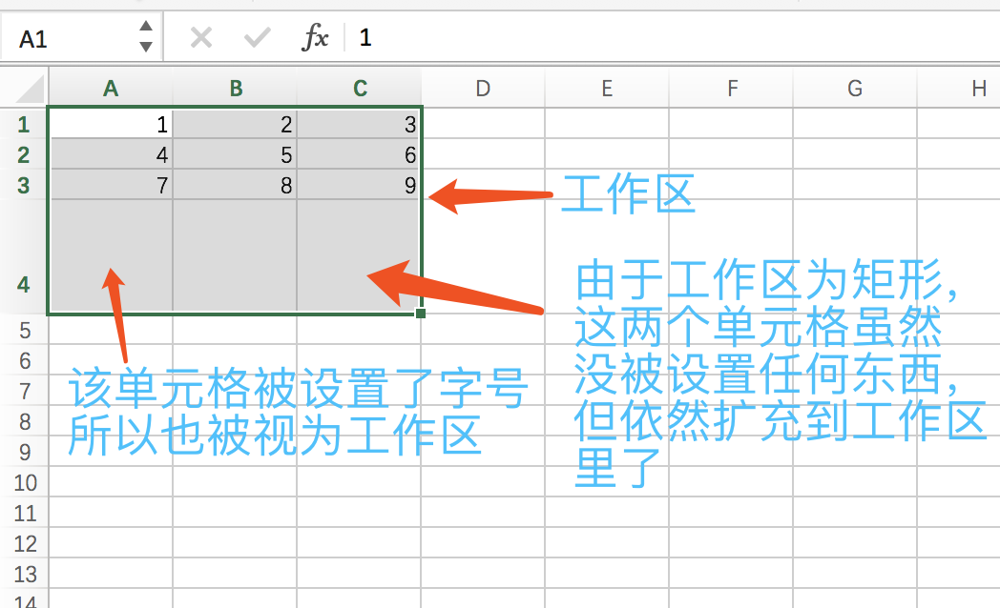

**********
单元格定位
**********

.. _single-cell:

单选
====

.. code-block:: php

    <?php

    use nulastudio\Document\EPPlus4PHP\ExcelPackage;

    $package = new ExcelPackage(__DIR__ . '/test.xlsx');

    $worksheet = $package->workBook->workSheets['sheet1'];

    $cellA1 = $worksheet->cells['A1'];

.. _single-column:

列选
====

.. code-block:: php

    <?php

    use nulastudio\Document\EPPlus4PHP\ExcelPackage;

    $package = new ExcelPackage(__DIR__ . '/test.xlsx');

    $worksheet = $package->workBook->workSheets['sheet1'];

    $columnA = $worksheet->cells['A:A'];

.. hint:: 可以使用简易格式

    - $columnA = $worksheet->cells['A'];

.. _single-row:

行选
====

.. code-block:: php

    <?php

    use nulastudio\Document\EPPlus4PHP\ExcelPackage;

    $package = new ExcelPackage(__DIR__ . '/test.xlsx');

    $worksheet = $package->workBook->workSheets['sheet1'];

    $row1 = $worksheet->cells['1:1'];

.. hint:: 可以使用简易格式

    - $row1 = $worksheet->cells['1'];

.. hint:: 索引从1开始

.. _window:

窗选/框选
=========

.. code-block:: php

    <?php

    use nulastudio\Document\EPPlus4PHP\ExcelPackage;

    $package = new ExcelPackage(__DIR__ . '/test.xlsx');

    $worksheet = $package->workBook->workSheets['sheet1'];

    $cellsA1_C3 = $worksheet->cells['A1:C3'];

.. _multi-areas:

多选
====

.. code-block:: php

    <?php

    use nulastudio\Document\EPPlus4PHP\ExcelPackage;

    $package = new ExcelPackage(__DIR__ . '/test.xlsx');

    $worksheet = $package->workBook->workSheets['sheet1'];

    $multi_cells = $worksheet->cells['A1:C3,D9,E8'];

.. _whole-sheet:

全选
====

.. code-block:: php

    <?php

    use nulastudio\Document\EPPlus4PHP\ExcelPackage;

    $package = new ExcelPackage(__DIR__ . '/test.xlsx');

    $worksheet = $package->workBook->workSheets['sheet1'];

    $whole_sheet = $worksheet->cells;

.. hint:: 全选是指全选整个工作表，如果你要全选数据区域（既工作区），请使用工作区的方式获取。

.. _dimension:

工作区
======

.. code-block:: php

    <?php

    use nulastudio\Document\EPPlus4PHP\ExcelPackage;

    $package = new ExcelPackage(__DIR__ . '/test.xlsx');

    $worksheet = $package->workBook->workSheets['sheet1'];

    $data_cells = $worksheet->datas;

.. hint:: 工作区的定义：如果一个单元格被使用了则被划分到工作区中，单元格有值或有样式都视为被使用了，如果你发现工作区莫名其妙的多了几行或者多了几列，那是因为虽然单元格里没有值，但是样式被改变了，所以统计到了工作区里。

