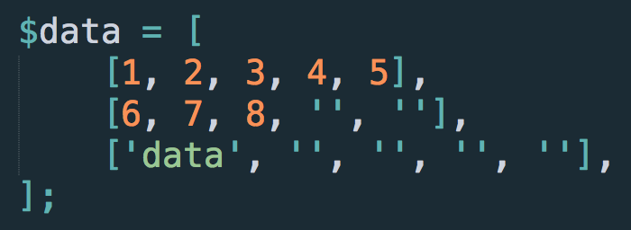

********
数据读写
********

.. _reading-a-single-cell:

读取单个单元格
==============

.. code-block:: php

    <?php

    use nulastudio\Document\EPPlus4PHP\ExcelPackage;

    $package = new ExcelPackage(__DIR__ . '/test.xlsx');

    $worksheet = $package->workBook->workSheets['sheet1'];

    $value = $worksheet->cells['A1'].value;

    vard_dump($value);

.. _reading-multi-cells:

读取区域
========

.. code-block:: php

    <?php

    use nulastudio\Document\EPPlus4PHP\ExcelPackage;

    $package = new ExcelPackage(__DIR__ . '/test.xlsx');

    $worksheet = $package->workBook->workSheets['sheet1'];

    $values = $worksheet->cells['A1:C3'].value;

    foreach($values as $row_data) {
        echo explode(',' $row_data);
        echo "\n";
    }

.. hint:: 区域返回的是二维数组

.. _writting-a-single-value:

写入单一值
==========

.. code-block:: php

    <?php

    use nulastudio\Document\EPPlus4PHP\ExcelPackage;

    $package = new ExcelPackage(__DIR__ . '/test.xlsx');

    $worksheet = $package->workBook->workSheets['sheet1'];

    $worksheet->cells['A1'].value = 'value1';

    // or
    // $worksheet->cells['A1:C9'].value = 'values';

    $package->save();

.. hint:: 无论你选择了多大的区域，都会将单一值赋值到每一个单元格中

.. _writting-multi-values:

写入多个值
==========

.. code-block:: php

    <?php

    use nulastudio\Document\EPPlus4PHP\ExcelPackage;

    $package = new ExcelPackage(__DIR__ . '/test.xlsx');

    $worksheet = $package->workBook->workSheets['sheet1'];

    $worksheet->cells['A1:C3'].value = [
        [1,2,3],
        [4,5,6],
        [7,8,9],
    ];

    $package->save();

.. hint:: 写入多个值采用的是交集的方式填充，对于长度不一致的行，将会使用空文本填充至最大长度，具体请看下面的图片

当数据区域大于单元格区域时，裁切数据区域的多余部分

最终结果

当数据区域小于单元格区域时，单元格区域多余部分将不做任何改变

最终结果

当数据区域长度不一致时，将使用空文本填充至最大长度

完全等价于

.. _writting-a-row:

写入一行
==========

.. code-block:: php

    <?php

    use nulastudio\Document\EPPlus4PHP\ExcelPackage;

    $package = new ExcelPackage(__DIR__ . '/test.xlsx');

    $worksheet = $package->workBook->workSheets['sheet1'];

    $worksheet->addRow([1, 2, 3, 4, 5]);

    $package->save();

.. _writting-a-column:

写入一列
==========

.. code-block:: php

    <?php

    use nulastudio\Document\EPPlus4PHP\ExcelPackage;

    $package = new ExcelPackage(__DIR__ . '/test.xlsx');

    $worksheet = $package->workBook->workSheets['sheet1'];

    $worksheet->addColumn([1, 2, 3, 4, 5]);

    $package->save();
